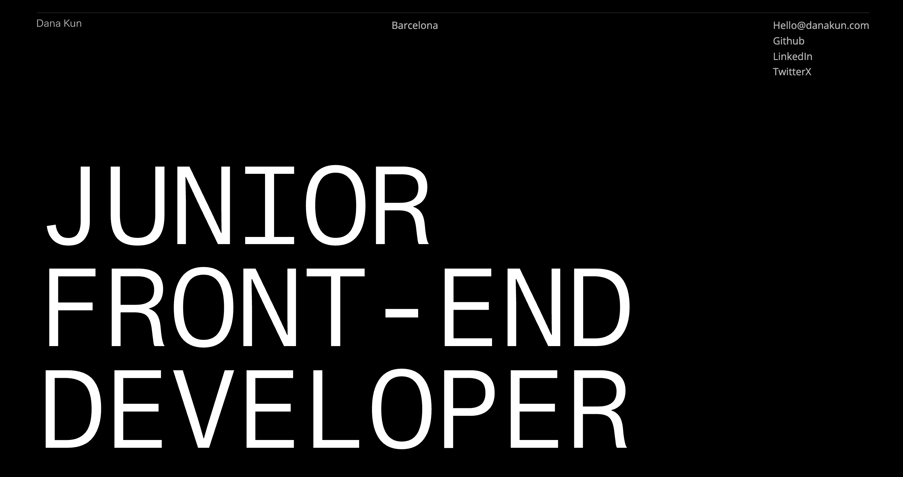

# Web Developer Portfolio

Welcome to my minimalist web developer portfolio! This project serves as a space to showcase my best works and provide a brief introduction about me. It's an ongoing project where I use HTML, CSS, and JavaScript to create a visually appealing and user-friendly portfolio.

## Features

- **Dark Mode**: The portfolio offers a dark mode for a sleek and comfortable viewing experience, especially during late hours.
- **Blur Effect**: I've implemented a blur effect to add a touch of creativity and style to the design.
- **Time at my Location**: I've added ty so the user can see what time is in my region when emails me.
- **Constant Work in Progress**: This portfolio is always evolving, and I'm continuously working on improvements.

## System Requirements

This project has minimal system requirements:

- A modern web browser with JavaScript enabled.

## Future Improvements

I have exciting plans for the future of this portfolio:

- **Add Links to Deployed Projects**: I'll provide direct links to the deployed versions of the projects I've showcased.
- **Expand Project Section**: More projects will be added to the portfolio, demonstrating my diverse skill set.
- **Improve Blur Usability**: I'll fine-tune the blur effect to make it even more visually appealing and user-friendly.
- **Add Videos on Hover**: To give visitors a closer look at my projects, I'll add video previews that play on hover.
- **Add Download Portfolio Link**: Users will be able to download a copy of my portfolio for offline viewing.

## About Me

I'm Dana Kun, a passionate front-end developer with a strong focus on user-centric design. I believe in the power of collaboration and continuous learning. If you'd like to know more about me or my work, feel free to visit my [portfolio](https://danakun.github.io/portfolio/).

Thank you for visiting, and I look forward to sharing more exciting projects with you in the future!

Designed and built by Dana Kun.
